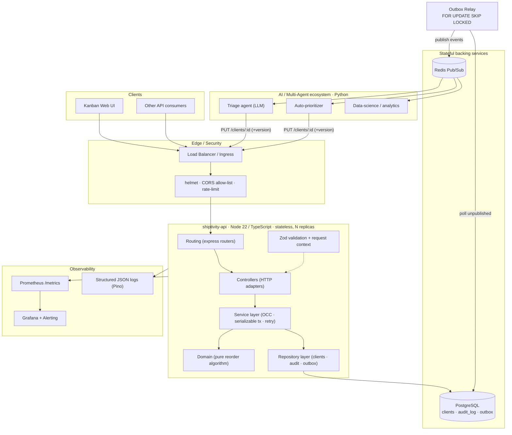
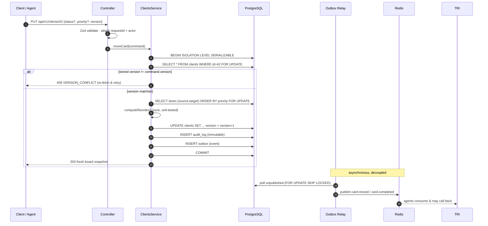
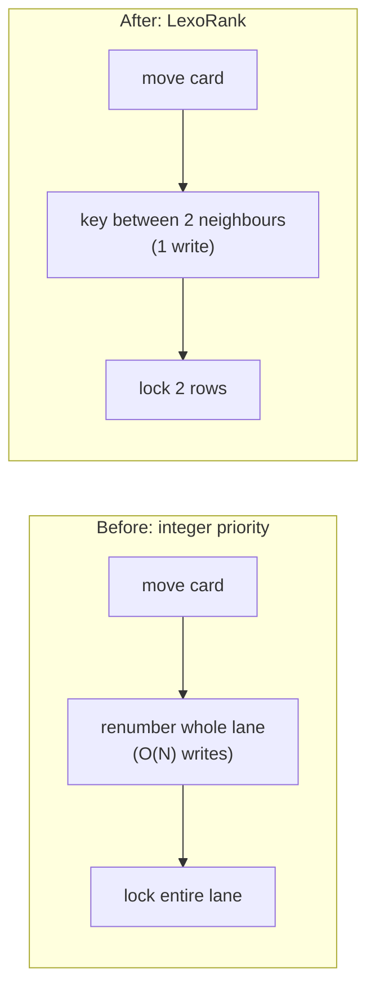
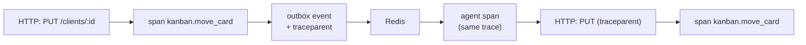
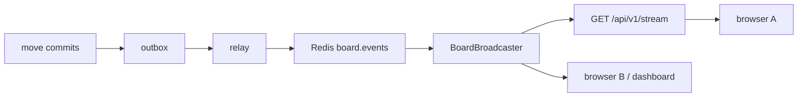

# Shiptivity-2 → Enterprise Kanban Microservice: Architecture & Enhancement Plan

This document elevates the prototype (`server.js` + `better-sqlite3`, with a stubbed
priority `TODO` and a parallel, contradictory Mongoose implementation) into an
advanced, fault-tolerant, horizontally-scalable microservice with the rigor of a
banking or institutional portfolio system.

The core domain is small but the correctness bar is high: three swimlanes
(`backlog`, `in-progress`, `complete`) where every card has a `status` (its lane)
and a `priority` (its 1-based order within the lane). The board invariant we
protect everywhere is: **for any lane, priorities are exactly `{1..N}` — no gaps,
no duplicates — even under concurrent moves.**

---

## 1. Target-state architecture



### The critical write path (PUT) in detail



### Layer map (what lives where)

```
src/
  domain/         pure business types + the reorder algorithm + error hierarchy
  schemas/        Zod request schemas (single source of validation truth)
  services/       transactional orchestration (OCC, locking, audit, outbox)
  repositories/   data access (Postgres); depend only on a Queryable interface
  db/             transaction.ts (driver-agnostic) + pool.ts (the only pg import)
  events/         event contracts, Redis publisher, outbox relay worker
  http/           routes → controllers → middleware (validate, security, errors)
  observability/  Prometheus metrics
  logger/         Pino + AsyncLocalStorage request correlation
  config/         fail-fast Zod-validated env config
  container/      composition root (manual dependency injection)
  index.ts        entrypoint: boot, start relay, graceful shutdown
```

---

## 2. Pillar 1 — Enterprise architectural patterns

**Layered, strictly-typed architecture.** The single 80-line `server.js` is
decomposed into one-responsibility layers with strict, one-directional
dependencies (`routing → controller → service → repository`, and everything may
depend on the pure `domain`). The HTTP layer knows nothing about SQL; the service
knows nothing about Express; the domain knows nothing about anything. This is what
makes the hard part — concurrency-safe reordering — independently testable.

**TypeScript migration.** The project is now TypeScript end-to-end, targeting
Node 22's native type-stripping (`--experimental-transform-types`) for dev/test
with zero build step, and `tsc` for the production `dist/` build.
`tsconfig.json` runs in the strictest practical mode: `strict`,
`noUncheckedIndexedAccess`, `verbatimModuleSyntax`. The legacy JS lives under
`legacy/` for reference and should be deleted once parity is confirmed.

> **Migration sequencing for a live system:** (1) introduce `tsconfig` +
> build with `allowJs` and run the JS as-is; (2) port leaf modules
> (domain, then repositories) to `.ts`; (3) port the service and routes; (4)
> flip the entrypoint; (5) delete `legacy/`. Each step ships independently.

**Dependency injection.** A manual composition root (`container/container.ts`)
constructs every concrete dependency once and injects via constructors. We chose
an explicit root over a reflection/decorator container deliberately: zero runtime
magic, fully type-checked wiring, and trivial substitution of fakes in tests
(see `test/clients.service.test.ts`, which runs the whole service with in-memory
repositories and **no database**).

**Central error handling.** `domain/errors.ts` defines an `AppError` hierarchy
(`ValidationError` 400, `NotFoundError` 404, `VersionConflictError` 409,
`ConcurrencyRetryExhaustedError` 503). One Express error middleware maps these to
`{ code, message, details, requestId }`; anything that is not an `AppError`
becomes an opaque 500 — internal details are logged, never leaked.

**Robust input validation.** `schemas/client.schema.ts` (Zod) is the single
source of truth. A generic `validate()` middleware parses params/body/query and
writes typed output to `res.locals`, so handlers receive validated, fully-typed
input and never touch raw `req.*`.

---

## 3. Pillar 2 — Advanced state & concurrency

This is where "elite" is earned. The prototype read the whole table, mutated one
field, and wrote back — a lost-update waiting to happen, with priority reordering
not implemented at all. The redesign uses **two complementary mechanisms**:

**(a) Optimistic concurrency control (OCC).** Every card carries a `version`.
Clients send the `version` they last read; the service rejects a mismatch with
`409 VERSION_CONFLICT`. This catches the *same-card stale-edit* race — two users
editing card 42 from different snapshots — and forces a re-sync instead of a
silent overwrite. Every touched row's `version` is incremented on write, so a
client holding a now-stale view of a *shuffled* card is also safely rejected.

**(b) Pessimistic lane locks under SERIALIZABLE.** The entire read-modify-write
runs in one `SERIALIZABLE` transaction that locks the affected lane(s)
`FOR UPDATE` before computing the new order. This catches the *different-cards,
same-lane* race — two users dropping different cards into `in-progress` at the
same instant — which OCC alone cannot, because neither card's version conflicts.
Lanes are locked in a deterministic (sorted) order, so concurrent cross-lane
moves can never deadlock. Serialization failures (SQLSTATE `40001`) and deadlocks
(`40P01`) are retried with bounded, jittered exponential backoff; exhaustion
surfaces as a ret-safe `503`.

**Database-enforced invariant.** A `DEFERRABLE INITIALLY DEFERRED` unique
constraint on `(status, priority)` makes it physically impossible to commit a
board with duplicate slots, while still allowing a multi-row reorder to pass
through transient intermediate states within the transaction.

**The reorder algorithm is pure.** `domain/reorder.ts` computes the minimal set
of `(id, status, priority)` changes for any move — in-lane up/down, cross-lane,
clamped out-of-range slots, no-ops — with no I/O. It returns *only the rows that
actually changed*, minimizing writes, lock footprint, and audit noise. It has
exhaustive unit tests (`test/reorder.test.ts`).

**Immutable audit logging.** Every state change writes one `audit_log` row inside
the same transaction (who, what, from→to status/priority, version before/after,
requestId, affected ids). Because it is co-transactional, the ledger can never
drift from reality. In production, `UPDATE`/`DELETE` on `audit_log` are revoked
from the app role, making it truly append-only.

---

## 4. Pillar 3 — AI/ML & multi-agent ecosystem integration

The board is designed to be driven by autonomous agents as first-class citizens,
not bolted-on webhooks.

**Transactional outbox.** Domain events are written to an `outbox` table in the
*same transaction* as the state change. There is no window in which the board
changes but the event is lost, or vice versa — the classic dual-write problem is
eliminated. A separate **Outbox Relay** drains the table using
`FOR UPDATE SKIP LOCKED` (so multiple relay instances scale horizontally without
double-publishing) and publishes to **Redis Pub/Sub**. Delivery is
**at-least-once**; every event carries a stable `eventId` and consumers dedupe.

**Event contract** (`events/eventTypes.ts`) — the public, versioned schema agents
consume:

```jsonc
{
  "eventId": "uuid",
  "type": "card.moved | card.completed | card.created",
  "occurredAt": "ISO-8601",
  "aggregateId": 42,
  "actor": "user:alice | agent:triage-bot",
  "requestId": "uuid",
  "data": {
    "from": { "status": "backlog", "priority": 7 },
    "to":   { "status": "in-progress", "priority": 1 },
    "versionBefore": 3, "versionAfter": 4,
    "affectedIds": [42, 11, 12]
  }
}
```

**Agents are just well-behaved API clients.** `agents/triage_agent.py` subscribes
to `board.events`, runs an LLM/classifier over a card's text description, and
calls the *same* `PUT /clients/:id` endpoint a human uses — carrying the card's
`version`. This means an agent **cannot corrupt the board**: a stale decision is
rejected with 409 exactly like a stale human edit, and all the concurrency
guarantees above apply uniformly. Auto-prioritization, automated triage, and
SLA/escalation bots all compose this way.

**Scale-out path to Kafka.** The publisher sits behind an `EventPublisher`
interface. Swapping Redis Pub/Sub for Kafka (durable, replayable, consumer
groups) is a single implementation change plus relay config — no service or
domain code changes. Use Redis for low-latency fan-out today; graduate to Kafka
when you need replay, ordering guarantees per partition, or high-throughput
stream processing.

---

## 5. Pillar 4 — Security, DevOps & observability

**API security.** `helmet` (secure headers), an explicit **CORS allow-list**
(not `*` in production), and a token-bucket **rate limiter** are applied at the
edge of the app. Bodies are size-capped (`64kb`). Injection is eliminated at the
data layer by exclusively parameterized SQL; input is type- and
shape-validated by Zod before it reaches a handler. (Roadmap: JWT/mTLS auth to
populate `actor`, per-route scopes, and `sanitize-html` on free-text fields if
they are ever rendered as HTML.)

**Containerization.** A multi-stage `Dockerfile` (builder → prod-deps → slim,
non-root runtime) with a `HEALTHCHECK`. `docker-compose.yml` brings up
`postgres + redis + api` with health-gated startup and runs migrations before
boot — `docker compose up` is a complete local environment.

**CI/CD.** `.github/workflows/ci.yml` runs typecheck → lint → tests (against
ephemeral Postgres + Redis services) → migrate smoke → build, then a gated Docker
image build with layer caching. **Deployment strategy:** stateless replicas
behind a load balancer; schema changes applied as a pre-deploy migration Job;
rolling or blue-green deploys (the app drains in-flight requests on `SIGTERM`).
Because every replica is stateless and the relay is concurrency-safe, you scale
horizontally by adding pods.

**Structured observability.** **Pino** emits JSON logs with automatic
`requestId`/`actor` correlation via `AsyncLocalStorage` and secret redaction.
**Prometheus** metrics at `/metrics` cover HTTP latency histograms plus domain
signals: `kanban_card_moves_total`, `kanban_version_conflicts_total`,
`db_tx_retries_total`, and `outbox_pending_events` (publish lag).
`/healthz` (liveness) and `/readyz` (dependency readiness) support orchestrators.

---

## 6. API contract — `PUT /api/v1/clients/:id`

Move and/or reorder a card. At least one of `status`/`priority` is required;
`version` is always required (blind writes are rejected).

```jsonc
// Request body
{
  "status": "in-progress",  // optional — omit to keep current lane
  "priority": 1,            // optional — omit to append to end of target lane
  "version": 3              // required — OCC token last read for this card
}
```

| Status | Code | Meaning |
| ------ | ---- | ------- |
| 200 | — | Move applied; returns the full, consistent board snapshot |
| 400 | `VALIDATION_ERROR` | Body/params failed schema validation |
| 404 | `NOT_FOUND` | Card does not exist |
| 409 | `VERSION_CONFLICT` | Card changed since the client's `version` — re-fetch & retry |
| 429 | `RATE_LIMITED` | Rate limit exceeded |
| 503 | `CONCURRENCY_RETRY_EXHAUSTED` | Serialization retries exhausted — safe to retry |

Headers: `x-request-id` (propagated or generated, echoed back), `x-actor-id`
(identity of the human/agent; replaced by auth in production).

---

## 7. Phased rollout

1. **Foundation** — TypeScript + layers + Zod + Pino + central errors (no
   behavior change). *Done in this repo.*
2. **Postgres + concurrency** — migrate off SQLite; add `version`, serializable
   transactions, lane locks, audit log. *Done.*
3. **Eventing** — outbox + relay + Redis; ship the event contract. *Done.*
4. **Agents** — deploy the Python triage/prioritizer consumers. *Reference impl
   provided.*
5. **Hardening** — auth (JWT/mTLS), Grafana dashboards + alerts, Kafka if/when
   replay/throughput demands it.

---

## 8. Local quickstart

```bash
# 1. bring up Postgres + Redis + API (runs migrations automatically)
docker compose up --build

# --- or run the API against local infra ---
cp .env.example .env
npm install
npm run migrate          # apply schema + seed
npm run dev              # watch-mode, native TS

# verify the core logic with zero infra:
npm test                 # rank-key stress tests + service OCC tests
npm run test:integration # real-Postgres integration + concurrency proof (needs Docker)
```

---

## 9. v2.1 advancements — LexoRank ordering & JWT auth

### 9.1 LexoRank (fractional-index) ordering — O(1) moves

The original integer `priority` made every reorder an **O(N) whole-lane rewrite**
that locked the entire lane. v2.1 replaces it with a **LexoRank/fractional-index
`rank` key** (`src/domain/rank.ts`): a compact, lexicographically-sortable string
where a new key can always be generated strictly between any two existing keys.

The payoff is structural:

- **A move updates ONE row.** Compute `generateKeyBetween(prev.rank, next.rank)`
  for the drop point and update only the moving card. No sibling rows change.
- **The lock footprint drops from O(N) to O(1).** The service locks only the
  moving card and the (≤2) neighbour rows around the drop point — not the lane.
  Concurrency throughput rises dramatically because non-adjacent moves in the
  same lane no longer contend.
- **Cross-lane moves need no source-lane repack** — the card just leaves; the
  gap it vacates in rank-space is harmless.
- **Correctness** is enforced two ways: a randomized property test drives 3,000
  inserts at random positions and asserts keys stay strictly ordered and unique
  (`test/rank.test.ts`), and a `DEFERRABLE UNIQUE (status, rank)` constraint
  makes a corrupt ordering uncommittable. The `rank` column is `COLLATE "C"` so
  Postgres byte-ordering matches the key generator exactly.

Positioning is now expressed **relative to neighbours** — `afterId` / `beforeId`
— the Trello/Linear model, which is race-friendly because neighbour ids are
stable references (a slot index shifts under concurrency). The legacy 1-based
`priority` is still accepted and translated for backward compatibility.

Operational note: keys can lengthen if users repeatedly drop into the exact same
gap. A background **rebalance** job can periodically reassign evenly-spaced keys
per lane (`generateNKeysBetween`); `scripts/backfill-rank.ts` shows the same
mechanism used to migrate an existing integer-priority table.



### 9.2 JWT authentication & scope authorization

`src/http/middleware/auth.ts` (using `jose`) adds real identity:

- **Verification:** HS256 shared secret by default; set `JWKS_URI` to verify
  RS256/ES256 tokens from an OIDC provider (Auth0/Cognito/Keycloak) via JWKS.
  Issuer/audience are checked.
- **Principal & correlation:** the verified `sub` becomes the request `actor`,
  flowing into structured logs and the immutable audit ledger — every change is
  now attributable to a real identity (human or `agent:*`).
- **Authorization:** `requireScope('board:write')` guards moves. Enforcement is
  feature-flagged by `AUTH_REQUIRED`: `false` in dev (anonymous allowed, scopes
  not enforced) and `true` in prod (valid token with the scope required).
- **Agents are first-class principals:** the Python triage agent presents a
  service JWT (`agent:triage-bot`, scope `board:write`); it is subject to the
  exact same OCC and authorization rules as a human, so it cannot corrupt the
  board. Mint a dev token with `npm run mint-token`.
- Health/readiness/metrics endpoints remain public for probes and scraping.

### 9.3 Updated `PUT /api/v1/clients/:id` contract

```jsonc
// Body — at least one of status/afterId/beforeId/priority; version required.
{
  "status": "in-progress",  // optional target lane
  "afterId": 7,             // optional: place immediately after card 7
  "beforeId": 9,            // optional: place immediately before card 9 (XOR afterId)
  "priority": 1,            // optional, DEPRECATED: legacy 1-based slot
  "version": 3              // required OCC token
}
```

`Authorization: Bearer <jwt>` is required when `AUTH_REQUIRED=true`. New status
codes: **401** `UNAUTHORIZED` (missing/invalid token), **403** `FORBIDDEN`
(missing `board:write` scope).

### 9.4 Proving it under load

`test/integration/` uses **Testcontainers** to run the real repositories +
service against a real PostgreSQL:

- `concurrency.integration.test.ts` fires many moves into the **same gap of one
  lane simultaneously** and asserts no duplicate ranks, no lost moves, and a
  strictly-ordered lane — the genuine proof of SERIALIZABLE + neighbour locks +
  the retry loop. It also verifies that 5 racers on the **same card** yield
  exactly one winner (OCC), the rest 409.
- `move.k6.js` is an HTTP-level load script (200/409 both pass — 409 is correct
  OCC behaviour under contention).

---

## 10. v2.2 advancements — distributed tracing & a live board

### 10.1 OpenTelemetry tracing (the third observability pillar)

Metrics tell you *how much*, logs tell you *what*; **traces tell you where the
time went and how a request fans out across services**. v2.2 adds OTel tracing
that spans the whole causal chain — including the asynchronous hop to the AI
agents, which is where distributed tracing earns its keep.

- **Injected, testable tracer.** The service depends on a tiny `Tracer`
  interface (`src/observability/tracer.ts`) whose default is a no-op, so unit
  tests stay dependency-free. The OTel-backed implementation
  (`src/observability/tracing.ts`, via `NodeSDK` + OTLP/HTTP) is injected by the
  container only in production.
- **Spans.** An HTTP `SERVER` span wraps each request (`middleware/tracing.ts`),
  and a `kanban.move_card` business span wraps the transaction (tagged with
  `client_id` and `enduser.id`). DB/redis spans can be added via
  auto-instrumentation.
- **Context threaded to agents.** When a move commits, the active W3C trace
  context is serialised into the outbox event (`event.trace`). The relay carries
  it to Redis; the Python agent reads `traceparent` and forwards it on its
  callback `PUT`, where the HTTP middleware **extracts and continues the same
  trace**. The result is one connected trace: `user request → move → event →
  agent triage → agent's move`.



Enable with `TRACING_ENABLED=true` and point `OTEL_EXPORTER_OTLP_ENDPOINT` at a
Collector/Jaeger — `docker compose up` includes an all-in-one Jaeger (UI on
`:16686`).

### 10.2 Real-time live board (SSE)

The outbox already publishes every change to Redis; v2.2 turns that stream into
a **live board**. A `BoardBroadcaster` (`src/realtime/broadcaster.ts`) subscribes
to `board.events` on a dedicated Redis connection and fans each event out to
connected clients over **Server-Sent Events** at `GET /api/v1/stream`.



- **Why SSE over WebSocket:** board updates are one-way (server → client). SSE is
  HTTP-native, passes through proxies/load balancers, auto-reconnects, and
  resumes via `Last-Event-ID` — no second protocol to operate. (Swap in `ws` if
  you later need client→server messaging.)
- **Auth:** the stream requires `board:read`; since `EventSource` can't set
  headers, the middleware also accepts `?access_token=<jwt>`.
- **Ops:** 25s heartbeats keep intermediaries from dropping idle streams, dead
  clients are pruned on write failure, and `sse_active_connections` is exported
  to Prometheus. `examples/live-board.html` is a ~50-line EventSource client that
  reflects moves live.

The chain is fully decoupled and horizontally scalable: any API replica can
serve the SSE endpoint, and every replica's broadcaster receives every event via
Redis fan-out.
