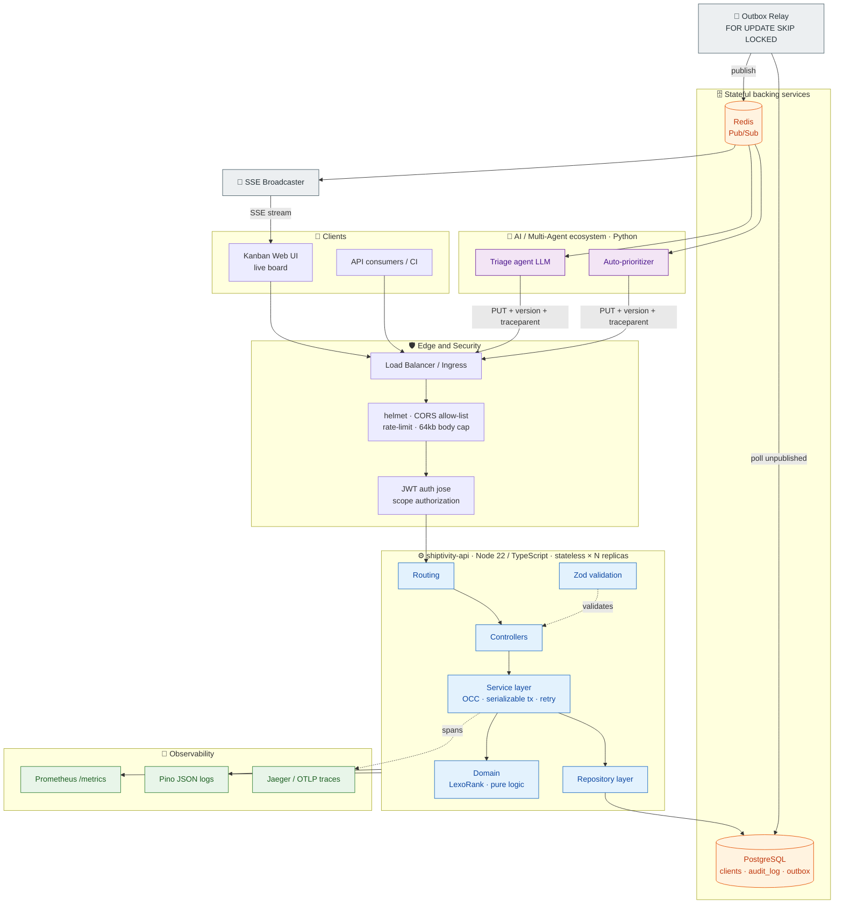
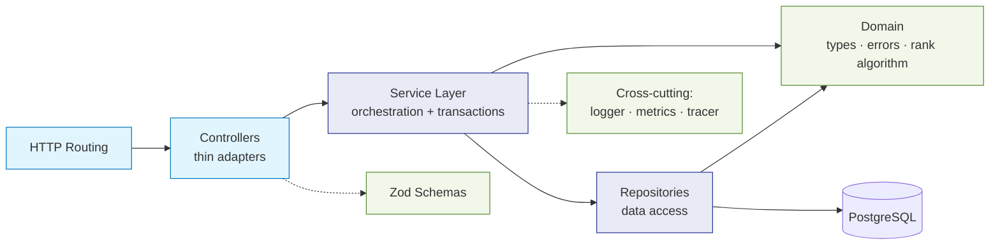
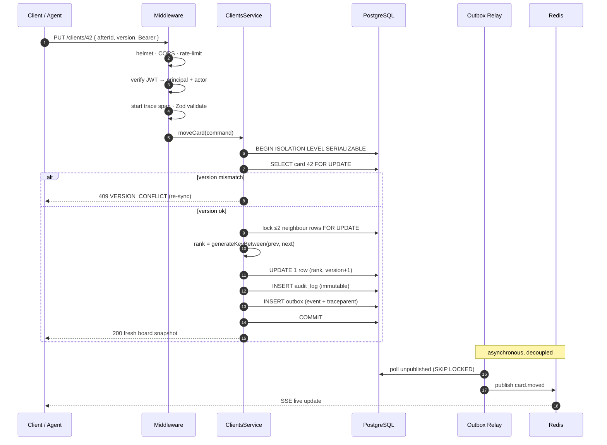
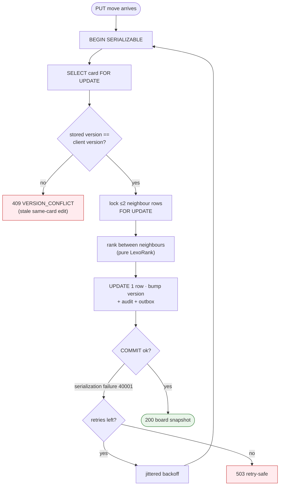
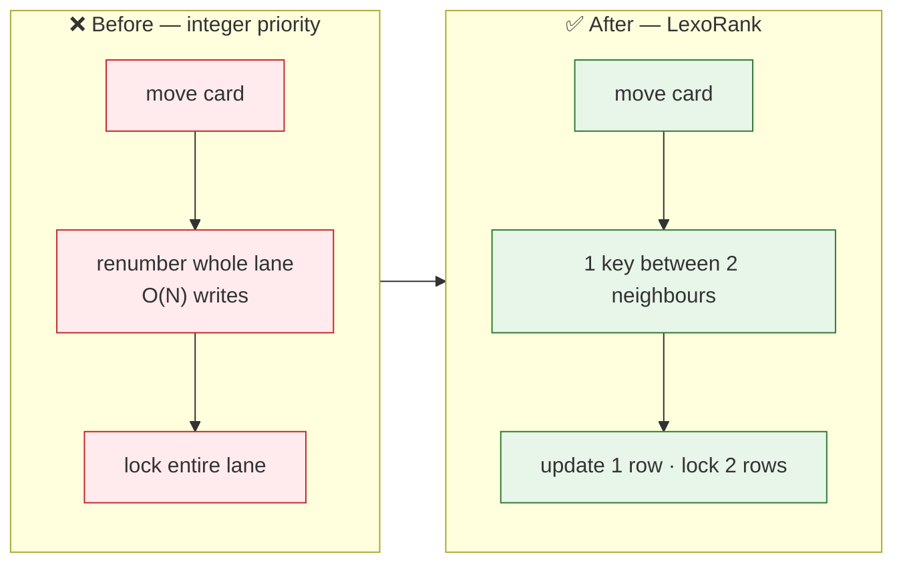
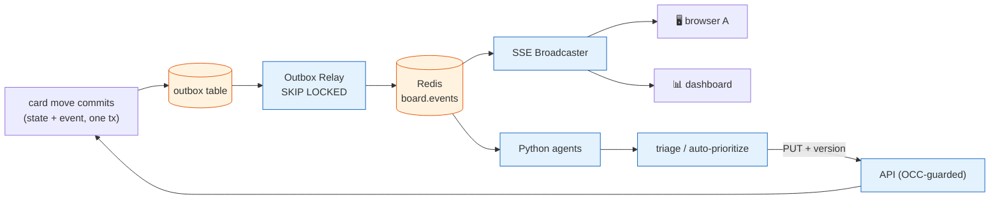
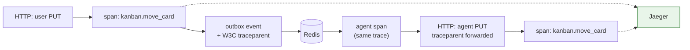
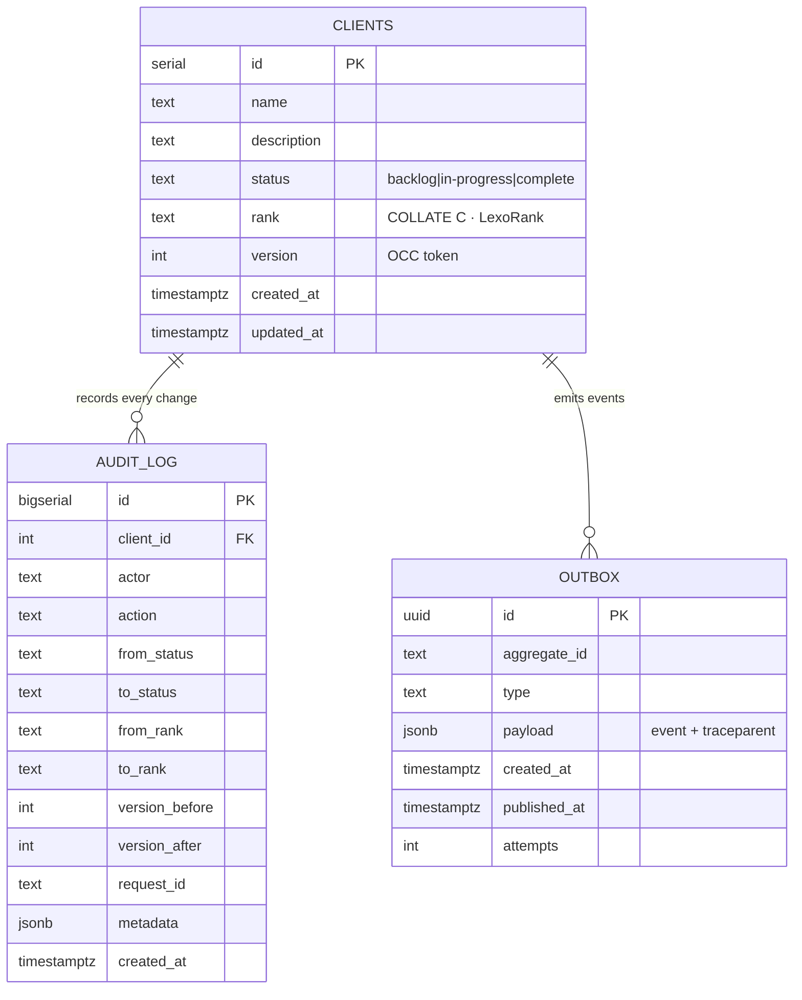
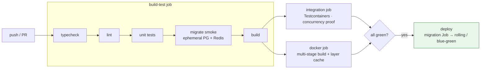
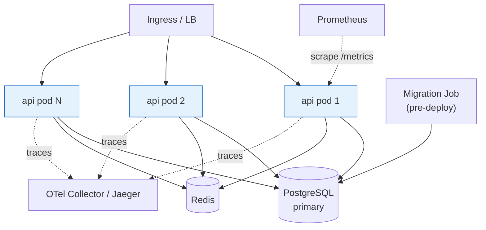

<div align="center">

# 🗂️ Shiptivity API v2 — Enterprise Kanban Microservice

**A Node.js/TypeScript prototype re-architected into a fault-tolerant, horizontally-scalable, event-driven microservice — with the concurrency rigor of a banking or portfolio-management system.**


</div>

---

## 📑 Table of contents

- [Overview](#-overview)
- [From prototype to production](#-from-prototype-to-production)
- [Key capabilities](#-key-capabilities)
- [System architecture](#-system-architecture)
- [Layered architecture](#-layered-architecture-clean--strictly-typed)
- [Request lifecycle](#-request-lifecycle-put-move)
- [Concurrency model](#-concurrency-model-the-hard-part)
- [LexoRank ordering](#-lexorank-ordering-on-move--o1)
- [Event pipeline & real-time board](#-event-pipeline--real-time-board)
- [Distributed tracing](#-distributed-tracing)
- [Data model](#-data-model)
- [CI/CD pipeline](#-cicd-pipeline)
- [Deployment topology](#-deployment-topology)
- [Tech stack](#-tech-stack)
- [Project structure](#-project-structure)
- [Quickstart](#-quickstart)
- [API reference](#-api-reference)
- [Verification & results](#-verification--results)
- [Industry-grade issues solved](#-industry-grade-issues-solved)
- [Roadmap](#-roadmap)

---

## 🔎 Overview

The board has three swimlanes — **`backlog` → `in-progress` → `complete`** — and every card carries a **`status`** (its lane) and a **`rank`** (its order within the lane). The single invariant the whole system protects is:

> **For any lane, ordering keys are unique and strictly increasing — no gaps, no duplicates — even when many users and AI agents move cards at the exact same instant.**

Getting that right under concurrency, while staying observable, secure, and horizontally scalable, is what turns a demo into a system you can run a business on.

---

## 🧬 From prototype to production

| | Original prototype | This service |
|---|---|---|
| Language | JavaScript + Babel | **TypeScript** (strict, Node 22 native) |
| Structure | One 80-line `server.js` | **Layered**: routes → controllers → services → repositories → domain |
| Persistence | `better-sqlite3`, plus a contradictory Mongoose file | **PostgreSQL** with migrations |
| Reordering | `// TODO: handle priority` (unimplemented) | **LexoRank** single-row, O(1) moves |
| Concurrency | Read-all → mutate → write (lost updates) | **OCC + `SERIALIZABLE` + row locks + retry** |
| Auditing | none | **Immutable, co-transactional audit ledger** |
| Eventing | `console.log` "email sent" | **Transactional outbox → Redis → agents** |
| Auth | none (`x-actor-id` header) | **JWT (jose) + scope authorization** |
| Observability | none | **Metrics + structured logs + distributed traces** |
| Real-time | none (poll) | **Server-Sent Events live board** |
| Delivery | none | **Docker, CI, Testcontainers, graceful shutdown** |

---

## ✨ Key capabilities

- 🧱 **Clean layered architecture** with dependency injection and a pure, exhaustively-tested domain core.
- 🔒 **Concurrency-safe by construction** — optimistic concurrency (`version`) + `SERIALIZABLE` transactions + `FOR UPDATE` neighbour locks + bounded serialization-failure retries.
- 🎯 **LexoRank ordering** — a move updates **one row** and locks only its two neighbours (O(1)), not the whole lane.
- 🧾 **Immutable audit trail** — every state change recorded in the same transaction as the change.
- 📨 **Transactional outbox** — no dual-write problem; events and state commit atomically, then relay to Redis.
- 🤖 **Agent-ready** — Python LLM agents consume events and call back as ordinary OCC-respecting clients (they *cannot* corrupt the board).
- 📡 **Live board over SSE** — the event stream is pushed straight to browsers.
- 🔭 **Full observability triad** — Prometheus metrics, Pino JSON logs with request correlation, and OpenTelemetry traces threaded end-to-end (including into the agents).
- 🚢 **Production delivery** — multi-stage Docker, docker-compose, GitHub Actions CI, health/readiness probes, graceful shutdown.

---

## 🏛️ System architecture



---

## 🧱 Layered architecture (clean & strictly typed)

Dependencies flow in **one direction only**. The HTTP layer knows nothing about SQL; the service knows nothing about Express; the domain knows nothing about anything. This is what makes the hard part — concurrency-safe reordering — independently testable.



Composition happens once in a **manual DI root** (`container/container.ts`) — zero reflection magic, fully type-checked wiring, trivially swappable fakes in tests.

---

## 🔁 Request lifecycle (PUT move)



---

## ⚔️ Concurrency model (the hard part)

The board is protected by **two complementary mechanisms** plus a **database-level backstop** — the same layered defense you'd design for money movement.



| Race | Caught by |
|---|---|
| Two users edit the **same card** from stale snapshots | Optimistic `version` token → `409` |
| Two users drop **different cards** into the **same lane/gap** | `SERIALIZABLE` + `FOR UPDATE` on neighbours → serialize + retry |
| Anything that would produce a duplicate slot | `DEFERRABLE UNIQUE (status, rank)` + `COLLATE "C"` → uncommittable |

---

## 🎯 LexoRank ordering: on move → O(1)

The original integer `priority` made every reorder an **O(N) whole-lane rewrite** that locked the entire lane. A fractional-index `rank` key means a move computes **one key between two neighbours** and updates **one row**.



Correctness is proven by a **randomized property test**: 3,000 inserts at random positions, asserting keys stay strictly ordered and unique (see [results](#-verification--results)).

---

## 📨 Event pipeline & real-time board

One transactional outbox feeds **both** the AI agents and the live UI. The chain is fully decoupled and horizontally scalable — any replica can serve SSE, and every replica's broadcaster receives every event via Redis fan-out.



**At-least-once delivery**: every event carries a stable `eventId`; consumers dedupe. **Why SSE over WebSocket** — board updates are one-way, and SSE is HTTP-native, proxy-friendly, and auto-reconnects.

---

## 🔭 Distributed tracing

Metrics tell you *how much*, logs tell you *what*, traces tell you *where the time went* — including the asynchronous hop to the agents, where distributed tracing earns its keep.



A no-op `Tracer` is the default (keeps unit tests dependency-free); the OpenTelemetry-backed tracer is injected only in production. `docker compose up` ships an all-in-one Jaeger (UI on `:16686`).

---

## 🗃️ Data model



Constraints: `UNIQUE (status, rank) DEFERRABLE INITIALLY DEFERRED`, `CHECK (status IN …)`, partial index on unpublished outbox rows.

---

## 🚀 CI/CD pipeline



---

## 🌐 Deployment topology



Every API replica is **stateless**; scale horizontally by adding pods. Schema changes ship as a pre-deploy migration Job; `SIGTERM` drains in-flight requests before exit.

---

## 🧰 Tech stack

| Concern | Choice |
|---|---|
| Runtime / language | Node.js 22 · TypeScript (strict, native type-stripping) |
| Web framework | Express |
| Validation | Zod |
| Database | PostgreSQL (`pg`) |
| Ordering | LexoRank / fractional indexing |
| Cache / bus | Redis (`ioredis`) Pub/Sub |
| Auth | JWT via `jose` (HS256 or OIDC/JWKS) |
| Logging | Pino (structured JSON) |
| Metrics | prom-client (Prometheus) |
| Tracing | OpenTelemetry (OTLP → Jaeger) |
| Security | helmet · CORS · express-rate-limit |
| Tests | Node test runner · Testcontainers · k6 |
| Delivery | Docker (multi-stage) · docker-compose · GitHub Actions |

---

## 🗂️ Project structure

```
src/
├── domain/          # pure types, error hierarchy, LexoRank algorithm
├── schemas/         # Zod request schemas (single source of validation truth)
├── services/        # transactional orchestration (OCC · locking · audit · outbox · spans)
├── repositories/    # data access (clients · audit · outbox)
├── db/              # transaction.ts (driver-agnostic) + pool.ts (the only pg import)
├── events/          # event contracts · Redis publisher · outbox relay
├── realtime/        # SSE broadcaster (Redis → browsers)
├── http/            # routes → controllers → middleware (auth · validate · trace · errors)
├── observability/   # metrics · tracer abstraction · OTel SDK
├── logger/          # Pino + AsyncLocalStorage request correlation
├── config/          # fail-fast Zod-validated env config
├── container/       # composition root (manual DI)
└── index.ts         # entrypoint: boot · relay · broadcaster · graceful shutdown
migrations/          # SQL schema + seed
scripts/             # migrate · mint-token · backfill-rank
test/                # unit tests + test/integration (Testcontainers) + test/load (k6)
agents/              # illustrative Python triage agent
examples/            # live-board.html (SSE demo client)
```

---

## ⚡ Quickstart

```bash
# Full stack (Postgres + Redis + Jaeger + API, migrations auto-applied)
docker compose up --build

# — or run locally against your own infra —
cp .env.example .env
npm install
npm run migrate                       # schema + seed
npm run dev                           # watch mode, native TypeScript

# verify the core logic with zero infra:
npm test                              # rank stress + service OCC tests
npm run test:integration              # real Postgres + concurrency proof (needs Docker)

# mint a dev JWT (for AUTH_REQUIRED=true / the agent):
npm run mint-token agent:bot "board:write"
```

Open `examples/live-board.html` in a browser to watch moves appear live over SSE.

---

## 📡 API reference

| Method | Path | Purpose | Scope |
|---|---|---|---|
| `GET` | `/api/v1/clients` | Full board (ordered) | `board:read` |
| `GET` | `/api/v1/clients/:id` | One card | `board:read` |
| `PUT` | `/api/v1/clients/:id` | Move / reorder a card | `board:write` |
| `GET` | `/api/v1/stream` | Live board updates (SSE) | `board:read` |
| `GET` | `/healthz` · `/readyz` · `/metrics` | Liveness · readiness · Prometheus | public |

**`PUT /api/v1/clients/:id`** — position relative to neighbours (preferred) or the legacy slot:

```jsonc
{
  "status": "in-progress",  // optional target lane (omit = keep current)
  "afterId": 7,             // optional: place immediately after card 7
  "beforeId": 9,            // optional: place immediately before card 9 (XOR afterId)
  "priority": 1,            // optional, DEPRECATED legacy 1-based slot
  "version": 3              // REQUIRED optimistic-concurrency token
}
```

| Code | Meaning |
|---|---|
| `200` | Applied — returns the fresh board snapshot |
| `400 VALIDATION_ERROR` | Body/params failed schema validation |
| `401 UNAUTHORIZED` / `403 FORBIDDEN` | Missing/invalid token · insufficient scope |
| `404 NOT_FOUND` | Card does not exist |
| `409 VERSION_CONFLICT` | Card changed since your `version` — re-fetch & retry |
| `429 RATE_LIMITED` | Rate limit exceeded |
| `503 CONCURRENCY_RETRY_EXHAUSTED` | Serialization retries exhausted — safe to retry |

---

## ✅ Verification & results

Every claim above is backed by executable proof. Below are the **actual outputs** captured from the test suites.

### LexoRank algorithm — including a 3,000-insert randomized property test

```text
$ node --test --experimental-transform-types test/rank.test.ts

ok 1 - known anchor keys
ok 2 - rejects inverted bounds
ok 3 - generateNKeysBetween returns n sorted, unique keys
ok 4 - randomized: 3000 inserts at random positions stay strictly ordered & unique
ok 5 - worst case: repeatedly inserting into the same shrinking gap stays ordered
ok 6 - always-prepend and always-append remain ordered
# tests 6
# pass 6
# fail 0
```

### Service layer — optimistic concurrency, neighbour resolution, no-op, cross-lane

```text
$ node --test --experimental-transform-types test/clients.service.test.ts

ok 1 - afterId places a card directly after the reference and bumps version
ok 2 - beforeId places a card directly before the reference
ok 3 - cross-lane move sets status, emits card.completed, old lane just loses the card
ok 4 - legacy priority slot is translated (priority:1 => front)
ok 5 - append (status only) puts the card last in the target lane
ok 6 - stale version is rejected with 409 and writes nothing
ok 7 - two concurrent moves: second (now stale) is rejected
ok 8 - no-op move (already in place) writes nothing
ok 9 - positioning relative to itself is a validation error
ok 10 - moving a non-existent card throws NotFound
# tests 10
# pass 10
# fail 0
```

### Combined run

```text
$ npm test
# tests 16
# pass 16
# fail 0
```

### Integration & concurrency proof (Testcontainers, real PostgreSQL — runs in CI)

```text
$ npm run test:integration

✓ cross-lane move persists, bumps version, writes audit + outbox
✓ stale version is rejected with 409 and persists nothing
✓ every lane keeps unique, strictly-increasing ranks (DB invariant)
✓ N concurrent moves into the front of one lane: no collisions, all applied
✓ concurrent moves of the SAME card: exactly one wins, others 409
```

### Source integrity (syntax / type-strip sweep)

```text
$ for f in $(find src test scripts -name '*.ts'); do node --check "$f"; done
ALL TS FILES PARSE OK   (domain, services, repositories, http, observability, realtime, …)
```

> **What this demonstrates:** the pure ordering math is exhaustively fuzzed; the service enforces OCC and produces audit + outbox side effects; and — critically — a real database under **maximum contention** (many moves into the same gap) never produces a duplicate or gapped rank, while same-card racers resolve to exactly one winner.

---

## 🏭 Industry-grade issues solved

| # | Real-world failure mode | How this project solves it |
|---|---|---|
| 1 | **Lost updates** — concurrent edits silently overwrite each other | Optimistic concurrency `version` token → `409`, forcing re-sync |
| 2 | **Ordering corruption** — two simultaneous moves duplicate/gap positions | `SERIALIZABLE` + `FOR UPDATE` neighbour locks + retry, backed by a `DEFERRABLE UNIQUE (status, rank)` constraint |
| 3 | **Reorder contention at scale** — renumbering a whole lane per move | LexoRank single-row O(1) move; lock footprint O(1) |
| 4 | **Collation bugs** — DB sorts keys differently than the app | `rank` column is `COLLATE "C"` (binary), matching the key generator |
| 5 | **Dual-write / lost events** — DB commits but the event is lost (or vice-versa) | Transactional outbox: event + state commit atomically |
| 6 | **Event double-processing** — at-least-once delivery replays | Stable `eventId` + consumer dedupe |
| 7 | **No traceability / compliance gaps** | Immutable, co-transactional audit ledger (revoke UPDATE/DELETE in prod) |
| 8 | **Unauthenticated writes** | JWT (jose) verification, HS256 or OIDC/JWKS, `board:write` scope |
| 9 | **Rogue automation corrupting data** | Agents are ordinary OCC-respecting clients — a stale agent decision is rejected exactly like a stale human edit |
| 10 | **Injection attacks** | Exclusively parameterized SQL + Zod-validated, typed input |
| 11 | **Config drift / boot with bad config** | Fail-fast Zod-validated environment config |
| 12 | **Leaking internals on error** | Central error handler → stable codes; unknown errors become opaque `500` |
| 13 | **Blind operations (no observability)** | Prometheus metrics + Pino JSON logs (request-correlated) + OpenTelemetry traces |
| 14 | **Broken distributed causality** | W3C trace context threaded through events into agents and back |
| 15 | **Thundering-herd retries / abuse** | Rate limiting + jittered exponential backoff on retries |
| 16 | **Unsafe deploys** | Multi-stage non-root Docker, health/readiness probes, `SIGTERM` graceful drain |
| 17 | **Stale UIs** | Real-time SSE push — no polling, auto-reconnect |
| 18 | **Untested concurrency claims** | Testcontainers concurrency test *proves* the guarantees against real Postgres |

---

## 🗺️ Roadmap

Natural next steps toward an even higher operational bar: OpenAPI generated from the Zod schemas, `Idempotency-Key` headers, outbox dead-letter handling, Redis-backed distributed rate limiting, a CQRS read-model cache, Helm/Terraform + progressive delivery, supply-chain scanning (SAST/Trivy/SBOM/cosign), and SLOs with alerting.

---

<div align="center">

**Built with the rigor of a system that moves money — applied to a board that moves cards.**

Full design rationale, sequence diagrams, and the phased rollout live in **[ARCHITECTURE.md](./ARCHITECTURE.md)**.

</div>
